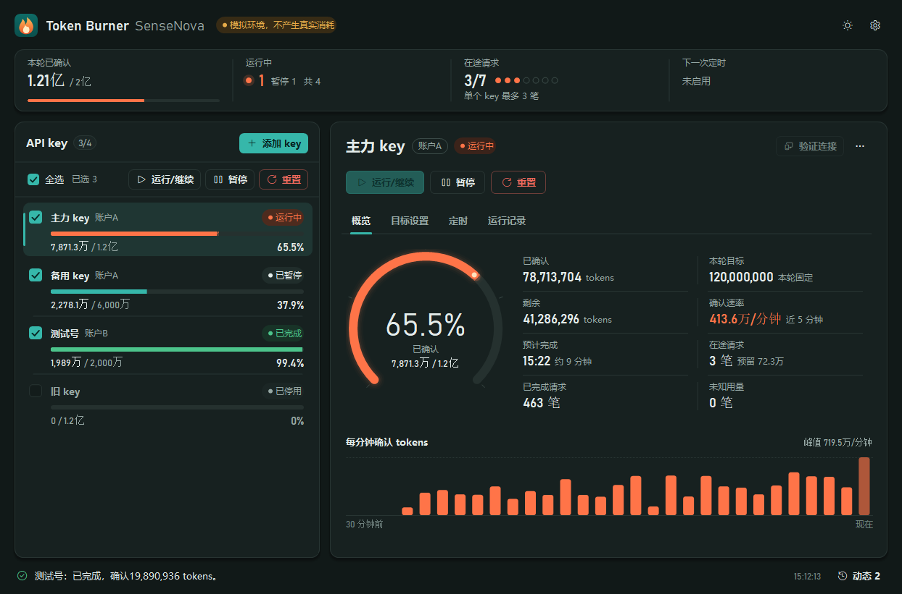
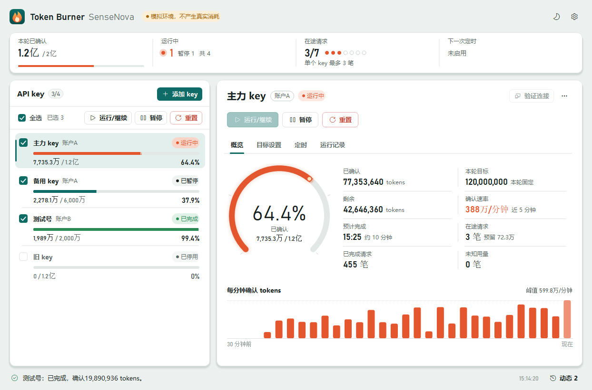

# SenseNova Token Burner

轻量的 Windows 11 x64 桌面面板：管理多个 SenseNova API key，按目标消耗 Flash-Lite 专属积分对应的 tokens，支持单独或批量运行/继续、暂停、重置，以及可选的定时运行。C# + WinForms，自包含 .NET 安装包，不需要 Python、SDK 或浏览器运行层。



## 功能

- **多 key 管理**：key 按当前 Windows 用户 DPAPI 加密保存，界面、配置和日志都不显示明文；名称和额度组选填。
- **燃烧仪表**：每个 key 显示已确认、目标、剩余、在途预留、确认速率、预计完成时间，概览页提供本周专属积分额度进度条与刷新倒计时，以及最近 30 分钟每分钟的确认用量。
- **目标**：0–95% 比例（95% 对应 1.2 亿 tokens，50% 对应 6000 万），四档预设，也可自定义 tokens 目标。
- **安全优先**：
  - 单个运行、批量运行、启用定时都会在联网前展示目标、单笔请求规模和额度风险，确认后才发请求；
  - “验证连接”只读取模型列表；
  - 结果未知的请求先人工核查，不自动重发；
  - 重置和删除都需要确认。
- **并发**：全应用共享上限 1–10（默认 3），单个 key 上限 1–10（默认 3）；同一个 key 不会被两个任务同时使用，一个任务出错不影响其他任务。
- **定时与周额度**：可选，默认间隔 5 小时，启用时立即开始首轮；支持按额度组配置每周刷新周期与专属积分上限，超额时自动跳过并在刷新后恢复；上一轮未结束或错过的周期不补跑。
- **托盘与外观**：关闭窗口收进托盘继续运行，“退出”才收尾结束；浅色、深色或跟随系统；正在消耗的任务统一用余烬橙色标出。



## 下载与安装

在 [Releases](https://github.com/Zhou-Jin-Feng/sensenova-token-burner/releases) 下载最新的 `SenseNova.TokenBurner-<版本>-win-x64-setup.exe`，并用随附的 `SHA256SUMS.txt` 核对哈希。安装、升级、卸载和数据位置见 [Windows 安装包](docs/Windows安装包.md)，上手步骤见[首次使用](docs/首次使用.md)。

## 使用

1. 点“添加 key”粘贴 API key。保存不会开始运行。
2. 先点“验证连接”，只读取模型列表，不发送生成请求。
3. 在“目标设置”页选择比例或自定义目标，保存。有未保存的修改时，运行、启用定时或切换任务都会先询问保存或放弃。
4. 点“运行/继续”：首次从 0 开始，暂停或中断后继续剩余目标。多个 key 可勾选后批量操作。
5. “暂停”保留进度；“重置”先收尾、把本轮归档到运行记录再归零，不会自动运行，也不会刷新官方额度。两者都会关闭定时。

服务地址固定为 `https://token.sensenova.cn/v1`，活动模型为 `sensenova-6.8-flash-lite`。

## 积分与验证边界

- **1.2 亿 tokens 只是经验估算。** 约等于 58,000 点专属积分，是特定条件下的经验值。超过可能扣通用积分，低于可能没用满专属积分；任何目标都不能保证绝对安全或精确返赠。实际扣减、额度和到账以 SenseNova 官方记录为准，客户端不查询余额。
- **多 key 不等于多份积分池。** 同一账户的多个 key 共享额度；5 小时只是本地运行计划，官方额度按滚动窗口计算。
- **v1.1 自动化验证：**
  - Release 构建 0 警告/0 错误，全量自动测试 361 项通过（面板测试在屏幕外运行）；
  - 覆盖：连接 GET-only，三类运行确认取消后零请求，删除后无残留行，勾选保持，未保存修改提示，定时间隔先保存，删除确认，单 key 并发与旧配置兼容，异常退出后核查继续，设置弹窗屏幕居中，周额度自然周换算与超额自动跳过定时；
  - mock 资源采样（3 个 key、共享并发 3、6 秒）：峰值 94.7–98.1 MiB，最多 3 笔在途，收尾时在途和未知均为 0，空闲 CPU 约 0.1%。
- **真实 API：** 此前版本曾用获授权的 key 完成一次受控的真实链路（1 GET + 1 POST，34 万字符输入，实际 usage 218,781 tokens）。v1.1 的运行引擎和请求路径与那时相同，但界面改版后没有再用真实 key 做完整验证。
- **安装与签名：** 安装包未签名；没有在全新 Windows 系统、其他设备或真实高 DPI 屏幕上做完整验收（150% 缩放只用缩放模拟验证过）。

## 文档

- [首次使用](docs/首次使用.md)
- [Windows 安装包](docs/Windows安装包.md)
- [基础架构与开发](docs/基础架构与开发.md)
- [需求与实现方案](docs/需求与实现方案.md)（需求调研、官方规则核查与设计取舍）
- [SenseNova 官方文档](https://platform.sensenova.cn/docs)

## 开发

.NET SDK `10.0.401` 由 global.json 固定。在项目根目录用 PowerShell 运行：

```powershell
& .\scripts\dev.ps1 restore
& .\scripts\dev.ps1 build
& .\scripts\dev.ps1 test
& .\scripts\dev.ps1 run
```

`dev.ps1 run` 始终使用进程内 HTTP mock：只接受虚拟 key（如 `mock-only-not-a-real-key-1`），不联网、不监听端口，数据在 `.local/mock-profile`。普通启动使用真实 HTTP，但添加、保存、重开都不会发请求；只有显式运行或启用定时才会校验模型并发送消耗请求。

用户数据在 `%LOCALAPPDATA%\SenseNova.TokenBurner\User`。仓库不得包含真实凭据、私人配置或运行记录，`agent/` 和 `.local/` 已忽略。结构、规则和测试说明见[基础架构与开发](docs/基础架构与开发.md)。

## 许可证

本项目以 [MIT 许可证](LICENSE) 发布。安装包随附的 .NET 运行时等第三方组件许可，见程序目录下的 `ThirdPartyNotices`。
